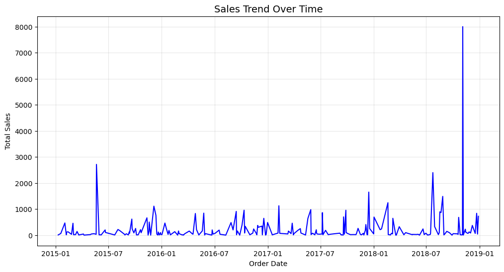
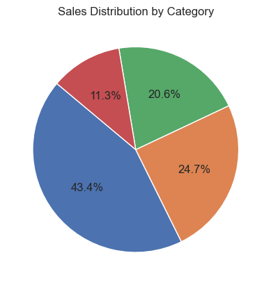
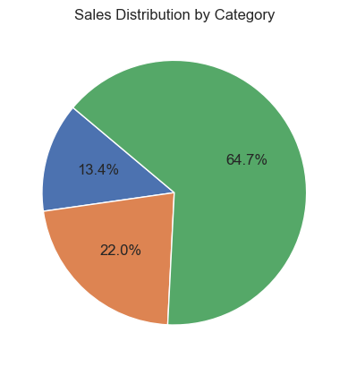

```python
#PROJECT TITLE: Retail Sales Analysis

#PROBLEM STATEMENT : The company wants to identify the top-performing products and regions to maximize revenue.

#DATA SOURCE : Kaggle Superstore dataset (9k rows, 13 columns).
```


```python
#STEPS TAKEN :
#1. Cleaned missing data and formatted dates in Excel.

#2. Performed sales aggregation by region and product category.

#3.Built pivot charts to visualize profit by region.
#Findings:

#4. The West region generates the highest revenue but lowest profit margins.

#5.Technology category contributes 45% of profit.
#Recommendation: Focus marketing on Technology products in the West region to increase profit margins.
```


```python
#PROJECT OBJECTIVE AND GOALS:
#Perform EDA and Predict the sales of the next 7 days from the last date of the Training dataset
#Find best-selling products, profit trends, and regional performance.
```


```python
#DATA SOURCE : Kaggle
#DATASET SIZE :
```


```python
#TOOLS : EXCEL( PIVOTTABLE, CHART,POWERQUERY),  JUPYTER NOTEBOOK,
```


```python
import pandas as pd
```


```python
df = pd.read_excel(r"C:\Users\Samson\Documents\trainer.xlsx")
```


```python
df
#removed duplicates in excel
```


<div>
<style scoped>
    .dataframe tbody tr th:only-of-type {
        vertical-align: middle;
    }

    .dataframe tbody tr th {
        vertical-align: top;
    }

    .dataframe thead th {
        text-align: right;
    }
</style>
<table border="1" class="dataframe">
  <thead>
    <tr style="text-align: right;">
      <th></th>
      <th>Row ID</th>
      <th>Order ID</th>
      <th>Order Date</th>
      <th>Ship Date</th>
      <th>Ship Mode</th>
      <th>Customer ID</th>
      <th>Customer Name</th>
      <th>Segment</th>
      <th>Country</th>
      <th>City</th>
      <th>State</th>
      <th>Postal Code</th>
      <th>Region</th>
      <th>Product ID</th>
      <th>Category</th>
      <th>Sub-Category</th>
      <th>Product Name</th>
      <th>Sales</th>
    </tr>
  </thead>
  <tbody>
    <tr>
      <th>0</th>
      <td>1</td>
      <td>CA-2017-152156</td>
      <td>2017-11-08</td>
      <td>2017-11-11</td>
      <td>Second Class</td>
      <td>CG-12520</td>
      <td>Claire Gute</td>
      <td>Consumer</td>
      <td>United States</td>
      <td>Henderson</td>
      <td>Kentucky</td>
      <td>42420</td>
      <td>South</td>
      <td>FUR-BO-10001798</td>
      <td>Furniture</td>
      <td>Bookcases</td>
      <td>Bush Somerset Collection Bookcase</td>
      <td>261.9600</td>
    </tr>
    <tr>
      <th>1</th>
      <td>3</td>
      <td>CA-2017-138688</td>
      <td>2017-06-12</td>
      <td>2017-06-16</td>
      <td>Second Class</td>
      <td>DV-13045</td>
      <td>Darrin Van Huff</td>
      <td>Corporate</td>
      <td>United States</td>
      <td>Los Angeles</td>
      <td>California</td>
      <td>90036</td>
      <td>West</td>
      <td>OFF-LA-10000240</td>
      <td>Office Supplies</td>
      <td>Labels</td>
      <td>Self-Adhesive Address Labels for Typewriters b...</td>
      <td>14.6200</td>
    </tr>
    <tr>
      <th>2</th>
      <td>4</td>
      <td>US-2016-108966</td>
      <td>2016-10-11</td>
      <td>2016-10-18</td>
      <td>Standard Class</td>
      <td>SO-20335</td>
      <td>Sean O'Donnell</td>
      <td>Consumer</td>
      <td>United States</td>
      <td>Fort Lauderdale</td>
      <td>Florida</td>
      <td>33311</td>
      <td>South</td>
      <td>FUR-TA-10000577</td>
      <td>Furniture</td>
      <td>Tables</td>
      <td>Bretford CR4500 Series Slim Rectangular Table</td>
      <td>957.5775</td>
    </tr>
    <tr>
      <th>3</th>
      <td>6</td>
      <td>CA-2015-115812</td>
      <td>2015-06-09</td>
      <td>2015-06-14</td>
      <td>Standard Class</td>
      <td>BH-11710</td>
      <td>Brosina Hoffman</td>
      <td>Consumer</td>
      <td>United States</td>
      <td>Los Angeles</td>
      <td>California</td>
      <td>90032</td>
      <td>West</td>
      <td>FUR-FU-10001487</td>
      <td>Furniture</td>
      <td>Furnishings</td>
      <td>Eldon Expressions Wood and Plastic Desk Access...</td>
      <td>48.8600</td>
    </tr>
    <tr>
      <th>4</th>
      <td>13</td>
      <td>CA-2018-114412</td>
      <td>2018-04-15</td>
      <td>2018-04-20</td>
      <td>Standard Class</td>
      <td>AA-10480</td>
      <td>Andrew Allen</td>
      <td>Consumer</td>
      <td>United States</td>
      <td>Concord</td>
      <td>North Carolina</td>
      <td>28027</td>
      <td>South</td>
      <td>OFF-PA-10002365</td>
      <td>Office Supplies</td>
      <td>Paper</td>
      <td>Xerox 1967</td>
      <td>15.5520</td>
    </tr>
    <tr>
      <th>...</th>
      <td>...</td>
      <td>...</td>
      <td>...</td>
      <td>...</td>
      <td>...</td>
      <td>...</td>
      <td>...</td>
      <td>...</td>
      <td>...</td>
      <td>...</td>
      <td>...</td>
      <td>...</td>
      <td>...</td>
      <td>...</td>
      <td>...</td>
      <td>...</td>
      <td>...</td>
      <td>...</td>
    </tr>
    <tr>
      <th>221</th>
      <td>6702</td>
      <td>CA-2016-153535</td>
      <td>2016-05-20</td>
      <td>2016-05-24</td>
      <td>Standard Class</td>
      <td>SG-20470</td>
      <td>Sheri Gordon</td>
      <td>Consumer</td>
      <td>United States</td>
      <td>Wilson</td>
      <td>North Carolina</td>
      <td>27893</td>
      <td>South</td>
      <td>FUR-FU-10001986</td>
      <td>Furniture</td>
      <td>Furnishings</td>
      <td>Dana Fluorescent Magnifying Lamp, White, 36"</td>
      <td>163.1360</td>
    </tr>
    <tr>
      <th>222</th>
      <td>6849</td>
      <td>US-2017-163461</td>
      <td>2017-06-18</td>
      <td>2017-06-21</td>
      <td>First Class</td>
      <td>BT-11440</td>
      <td>Bobby Trafton</td>
      <td>Consumer</td>
      <td>United States</td>
      <td>Frankfort</td>
      <td>Illinois</td>
      <td>60423</td>
      <td>Central</td>
      <td>OFF-PA-10003134</td>
      <td>Office Supplies</td>
      <td>Paper</td>
      <td>Xerox 1937</td>
      <td>76.8640</td>
    </tr>
    <tr>
      <th>223</th>
      <td>6902</td>
      <td>US-2018-135013</td>
      <td>2018-07-24</td>
      <td>2018-07-24</td>
      <td>Same Day</td>
      <td>HR-14830</td>
      <td>Harold Ryan</td>
      <td>Corporate</td>
      <td>United States</td>
      <td>Huntington Beach</td>
      <td>California</td>
      <td>92646</td>
      <td>West</td>
      <td>TEC-CO-10001449</td>
      <td>Technology</td>
      <td>Copiers</td>
      <td>Hewlett Packard LaserJet 3310 Copier</td>
      <td>2399.9600</td>
    </tr>
    <tr>
      <th>224</th>
      <td>8909</td>
      <td>CA-2016-109603</td>
      <td>2016-01-26</td>
      <td>2016-02-01</td>
      <td>Standard Class</td>
      <td>EM-13825</td>
      <td>Elizabeth Moffitt</td>
      <td>Corporate</td>
      <td>United States</td>
      <td>Moreno Valley</td>
      <td>California</td>
      <td>92553</td>
      <td>West</td>
      <td>OFF-PA-10003790</td>
      <td>Office Supplies</td>
      <td>Paper</td>
      <td>Xerox 1991</td>
      <td>182.7200</td>
    </tr>
    <tr>
      <th>225</th>
      <td>9766</td>
      <td>CA-2018-101959</td>
      <td>2018-02-28</td>
      <td>2018-03-06</td>
      <td>Standard Class</td>
      <td>DB-13660</td>
      <td>Duane Benoit</td>
      <td>Consumer</td>
      <td>United States</td>
      <td>Middletown</td>
      <td>Connecticut</td>
      <td>6457</td>
      <td>East</td>
      <td>OFF-BI-10001757</td>
      <td>Office Supplies</td>
      <td>Binders</td>
      <td>Pressboard Hanging Data Binders for Unburst Sh...</td>
      <td>9.8400</td>
    </tr>
  </tbody>
</table>
<p>226 rows × 18 columns</p>
</div>


```python
#converting date columns to datetime format
df['Order Date'] = pd.to_datetime(df['Order Date'])
```


```python
#creating profit colums
#since there's no cost price column to input profits, we create a cost price column and get a 10% deduction for each product

df['Cost_Price'] = df['Sales'] * 0.90

```


```python
df['Cost_Price']
```


    0       235.76400
    1        13.15800
    2       861.81975
    3        43.97400
    4        13.99680
              ...    
    221     146.82240
    222      69.17760
    223    2159.96400
    224     164.44800
    225       8.85600
    Name: Cost_Price, Length: 226, dtype: float64


```python
df['Profit'] = df['Sales'] - df['Cost_Price']
```


```python
df['Profit']
```


    0       26.19600
    1        1.46200
    2       95.75775
    3        4.88600
    4        1.55520
             ...    
    221     16.31360
    222      7.68640
    223    239.99600
    224     18.27200
    225      0.98400
    Name: Profit, Length: 226, dtype: float64


```python
df
```


<div>
<style scoped>
    .dataframe tbody tr th:only-of-type {
        vertical-align: middle;
    }

    .dataframe tbody tr th {
        vertical-align: top;
    }

    .dataframe thead th {
        text-align: right;
    }
</style>
<table border="1" class="dataframe">
  <thead>
    <tr style="text-align: right;">
      <th></th>
      <th>Row ID</th>
      <th>Order ID</th>
      <th>Order Date</th>
      <th>Ship Date</th>
      <th>Ship Mode</th>
      <th>Customer ID</th>
      <th>Customer Name</th>
      <th>Segment</th>
      <th>Country</th>
      <th>City</th>
      <th>State</th>
      <th>Postal Code</th>
      <th>Region</th>
      <th>Product ID</th>
      <th>Category</th>
      <th>Sub-Category</th>
      <th>Product Name</th>
      <th>Sales</th>
      <th>Cost_Price</th>
      <th>Profit</th>
    </tr>
  </thead>
  <tbody>
    <tr>
      <th>0</th>
      <td>1</td>
      <td>CA-2017-152156</td>
      <td>2017-11-08</td>
      <td>2017-11-11</td>
      <td>Second Class</td>
      <td>CG-12520</td>
      <td>Claire Gute</td>
      <td>Consumer</td>
      <td>United States</td>
      <td>Henderson</td>
      <td>Kentucky</td>
      <td>42420</td>
      <td>South</td>
      <td>FUR-BO-10001798</td>
      <td>Furniture</td>
      <td>Bookcases</td>
      <td>Bush Somerset Collection Bookcase</td>
      <td>261.9600</td>
      <td>235.76400</td>
      <td>26.19600</td>
    </tr>
    <tr>
      <th>1</th>
      <td>3</td>
      <td>CA-2017-138688</td>
      <td>2017-06-12</td>
      <td>2017-06-16</td>
      <td>Second Class</td>
      <td>DV-13045</td>
      <td>Darrin Van Huff</td>
      <td>Corporate</td>
      <td>United States</td>
      <td>Los Angeles</td>
      <td>California</td>
      <td>90036</td>
      <td>West</td>
      <td>OFF-LA-10000240</td>
      <td>Office Supplies</td>
      <td>Labels</td>
      <td>Self-Adhesive Address Labels for Typewriters b...</td>
      <td>14.6200</td>
      <td>13.15800</td>
      <td>1.46200</td>
    </tr>
    <tr>
      <th>2</th>
      <td>4</td>
      <td>US-2016-108966</td>
      <td>2016-10-11</td>
      <td>2016-10-18</td>
      <td>Standard Class</td>
      <td>SO-20335</td>
      <td>Sean O'Donnell</td>
      <td>Consumer</td>
      <td>United States</td>
      <td>Fort Lauderdale</td>
      <td>Florida</td>
      <td>33311</td>
      <td>South</td>
      <td>FUR-TA-10000577</td>
      <td>Furniture</td>
      <td>Tables</td>
      <td>Bretford CR4500 Series Slim Rectangular Table</td>
      <td>957.5775</td>
      <td>861.81975</td>
      <td>95.75775</td>
    </tr>
    <tr>
      <th>3</th>
      <td>6</td>
      <td>CA-2015-115812</td>
      <td>2015-06-09</td>
      <td>2015-06-14</td>
      <td>Standard Class</td>
      <td>BH-11710</td>
      <td>Brosina Hoffman</td>
      <td>Consumer</td>
      <td>United States</td>
      <td>Los Angeles</td>
      <td>California</td>
      <td>90032</td>
      <td>West</td>
      <td>FUR-FU-10001487</td>
      <td>Furniture</td>
      <td>Furnishings</td>
      <td>Eldon Expressions Wood and Plastic Desk Access...</td>
      <td>48.8600</td>
      <td>43.97400</td>
      <td>4.88600</td>
    </tr>
    <tr>
      <th>4</th>
      <td>13</td>
      <td>CA-2018-114412</td>
      <td>2018-04-15</td>
      <td>2018-04-20</td>
      <td>Standard Class</td>
      <td>AA-10480</td>
      <td>Andrew Allen</td>
      <td>Consumer</td>
      <td>United States</td>
      <td>Concord</td>
      <td>North Carolina</td>
      <td>28027</td>
      <td>South</td>
      <td>OFF-PA-10002365</td>
      <td>Office Supplies</td>
      <td>Paper</td>
      <td>Xerox 1967</td>
      <td>15.5520</td>
      <td>13.99680</td>
      <td>1.55520</td>
    </tr>
    <tr>
      <th>...</th>
      <td>...</td>
      <td>...</td>
      <td>...</td>
      <td>...</td>
      <td>...</td>
      <td>...</td>
      <td>...</td>
      <td>...</td>
      <td>...</td>
      <td>...</td>
      <td>...</td>
      <td>...</td>
      <td>...</td>
      <td>...</td>
      <td>...</td>
      <td>...</td>
      <td>...</td>
      <td>...</td>
      <td>...</td>
      <td>...</td>
    </tr>
    <tr>
      <th>221</th>
      <td>6702</td>
      <td>CA-2016-153535</td>
      <td>2016-05-20</td>
      <td>2016-05-24</td>
      <td>Standard Class</td>
      <td>SG-20470</td>
      <td>Sheri Gordon</td>
      <td>Consumer</td>
      <td>United States</td>
      <td>Wilson</td>
      <td>North Carolina</td>
      <td>27893</td>
      <td>South</td>
      <td>FUR-FU-10001986</td>
      <td>Furniture</td>
      <td>Furnishings</td>
      <td>Dana Fluorescent Magnifying Lamp, White, 36"</td>
      <td>163.1360</td>
      <td>146.82240</td>
      <td>16.31360</td>
    </tr>
    <tr>
      <th>222</th>
      <td>6849</td>
      <td>US-2017-163461</td>
      <td>2017-06-18</td>
      <td>2017-06-21</td>
      <td>First Class</td>
      <td>BT-11440</td>
      <td>Bobby Trafton</td>
      <td>Consumer</td>
      <td>United States</td>
      <td>Frankfort</td>
      <td>Illinois</td>
      <td>60423</td>
      <td>Central</td>
      <td>OFF-PA-10003134</td>
      <td>Office Supplies</td>
      <td>Paper</td>
      <td>Xerox 1937</td>
      <td>76.8640</td>
      <td>69.17760</td>
      <td>7.68640</td>
    </tr>
    <tr>
      <th>223</th>
      <td>6902</td>
      <td>US-2018-135013</td>
      <td>2018-07-24</td>
      <td>2018-07-24</td>
      <td>Same Day</td>
      <td>HR-14830</td>
      <td>Harold Ryan</td>
      <td>Corporate</td>
      <td>United States</td>
      <td>Huntington Beach</td>
      <td>California</td>
      <td>92646</td>
      <td>West</td>
      <td>TEC-CO-10001449</td>
      <td>Technology</td>
      <td>Copiers</td>
      <td>Hewlett Packard LaserJet 3310 Copier</td>
      <td>2399.9600</td>
      <td>2159.96400</td>
      <td>239.99600</td>
    </tr>
    <tr>
      <th>224</th>
      <td>8909</td>
      <td>CA-2016-109603</td>
      <td>2016-01-26</td>
      <td>2016-02-01</td>
      <td>Standard Class</td>
      <td>EM-13825</td>
      <td>Elizabeth Moffitt</td>
      <td>Corporate</td>
      <td>United States</td>
      <td>Moreno Valley</td>
      <td>California</td>
      <td>92553</td>
      <td>West</td>
      <td>OFF-PA-10003790</td>
      <td>Office Supplies</td>
      <td>Paper</td>
      <td>Xerox 1991</td>
      <td>182.7200</td>
      <td>164.44800</td>
      <td>18.27200</td>
    </tr>
    <tr>
      <th>225</th>
      <td>9766</td>
      <td>CA-2018-101959</td>
      <td>2018-02-28</td>
      <td>2018-03-06</td>
      <td>Standard Class</td>
      <td>DB-13660</td>
      <td>Duane Benoit</td>
      <td>Consumer</td>
      <td>United States</td>
      <td>Middletown</td>
      <td>Connecticut</td>
      <td>6457</td>
      <td>East</td>
      <td>OFF-BI-10001757</td>
      <td>Office Supplies</td>
      <td>Binders</td>
      <td>Pressboard Hanging Data Binders for Unburst Sh...</td>
      <td>9.8400</td>
      <td>8.85600</td>
      <td>0.98400</td>
    </tr>
  </tbody>
</table>
<p>226 rows × 20 columns</p>
</div>


```python
df = df.drop('Cost_Price', axis= 1)
```


```python
df
```


<div>
<style scoped>
    .dataframe tbody tr th:only-of-type {
        vertical-align: middle;
    }

    .dataframe tbody tr th {
        vertical-align: top;
    }

    .dataframe thead th {
        text-align: right;
    }
</style>
<table border="1" class="dataframe">
  <thead>
    <tr style="text-align: right;">
      <th></th>
      <th>Row ID</th>
      <th>Order ID</th>
      <th>Order Date</th>
      <th>Ship Date</th>
      <th>Ship Mode</th>
      <th>Customer ID</th>
      <th>Customer Name</th>
      <th>Segment</th>
      <th>Country</th>
      <th>City</th>
      <th>State</th>
      <th>Postal Code</th>
      <th>Region</th>
      <th>Product ID</th>
      <th>Category</th>
      <th>Sub-Category</th>
      <th>Product Name</th>
      <th>Sales</th>
      <th>Profit</th>
    </tr>
  </thead>
  <tbody>
    <tr>
      <th>0</th>
      <td>1</td>
      <td>CA-2017-152156</td>
      <td>2017-11-08</td>
      <td>2017-11-11</td>
      <td>Second Class</td>
      <td>CG-12520</td>
      <td>Claire Gute</td>
      <td>Consumer</td>
      <td>United States</td>
      <td>Henderson</td>
      <td>Kentucky</td>
      <td>42420</td>
      <td>South</td>
      <td>FUR-BO-10001798</td>
      <td>Furniture</td>
      <td>Bookcases</td>
      <td>Bush Somerset Collection Bookcase</td>
      <td>261.9600</td>
      <td>26.19600</td>
    </tr>
    <tr>
      <th>1</th>
      <td>3</td>
      <td>CA-2017-138688</td>
      <td>2017-06-12</td>
      <td>2017-06-16</td>
      <td>Second Class</td>
      <td>DV-13045</td>
      <td>Darrin Van Huff</td>
      <td>Corporate</td>
      <td>United States</td>
      <td>Los Angeles</td>
      <td>California</td>
      <td>90036</td>
      <td>West</td>
      <td>OFF-LA-10000240</td>
      <td>Office Supplies</td>
      <td>Labels</td>
      <td>Self-Adhesive Address Labels for Typewriters b...</td>
      <td>14.6200</td>
      <td>1.46200</td>
    </tr>
    <tr>
      <th>2</th>
      <td>4</td>
      <td>US-2016-108966</td>
      <td>2016-10-11</td>
      <td>2016-10-18</td>
      <td>Standard Class</td>
      <td>SO-20335</td>
      <td>Sean O'Donnell</td>
      <td>Consumer</td>
      <td>United States</td>
      <td>Fort Lauderdale</td>
      <td>Florida</td>
      <td>33311</td>
      <td>South</td>
      <td>FUR-TA-10000577</td>
      <td>Furniture</td>
      <td>Tables</td>
      <td>Bretford CR4500 Series Slim Rectangular Table</td>
      <td>957.5775</td>
      <td>95.75775</td>
    </tr>
    <tr>
      <th>3</th>
      <td>6</td>
      <td>CA-2015-115812</td>
      <td>2015-06-09</td>
      <td>2015-06-14</td>
      <td>Standard Class</td>
      <td>BH-11710</td>
      <td>Brosina Hoffman</td>
      <td>Consumer</td>
      <td>United States</td>
      <td>Los Angeles</td>
      <td>California</td>
      <td>90032</td>
      <td>West</td>
      <td>FUR-FU-10001487</td>
      <td>Furniture</td>
      <td>Furnishings</td>
      <td>Eldon Expressions Wood and Plastic Desk Access...</td>
      <td>48.8600</td>
      <td>4.88600</td>
    </tr>
    <tr>
      <th>4</th>
      <td>13</td>
      <td>CA-2018-114412</td>
      <td>2018-04-15</td>
      <td>2018-04-20</td>
      <td>Standard Class</td>
      <td>AA-10480</td>
      <td>Andrew Allen</td>
      <td>Consumer</td>
      <td>United States</td>
      <td>Concord</td>
      <td>North Carolina</td>
      <td>28027</td>
      <td>South</td>
      <td>OFF-PA-10002365</td>
      <td>Office Supplies</td>
      <td>Paper</td>
      <td>Xerox 1967</td>
      <td>15.5520</td>
      <td>1.55520</td>
    </tr>
    <tr>
      <th>...</th>
      <td>...</td>
      <td>...</td>
      <td>...</td>
      <td>...</td>
      <td>...</td>
      <td>...</td>
      <td>...</td>
      <td>...</td>
      <td>...</td>
      <td>...</td>
      <td>...</td>
      <td>...</td>
      <td>...</td>
      <td>...</td>
      <td>...</td>
      <td>...</td>
      <td>...</td>
      <td>...</td>
      <td>...</td>
    </tr>
    <tr>
      <th>221</th>
      <td>6702</td>
      <td>CA-2016-153535</td>
      <td>2016-05-20</td>
      <td>2016-05-24</td>
      <td>Standard Class</td>
      <td>SG-20470</td>
      <td>Sheri Gordon</td>
      <td>Consumer</td>
      <td>United States</td>
      <td>Wilson</td>
      <td>North Carolina</td>
      <td>27893</td>
      <td>South</td>
      <td>FUR-FU-10001986</td>
      <td>Furniture</td>
      <td>Furnishings</td>
      <td>Dana Fluorescent Magnifying Lamp, White, 36"</td>
      <td>163.1360</td>
      <td>16.31360</td>
    </tr>
    <tr>
      <th>222</th>
      <td>6849</td>
      <td>US-2017-163461</td>
      <td>2017-06-18</td>
      <td>2017-06-21</td>
      <td>First Class</td>
      <td>BT-11440</td>
      <td>Bobby Trafton</td>
      <td>Consumer</td>
      <td>United States</td>
      <td>Frankfort</td>
      <td>Illinois</td>
      <td>60423</td>
      <td>Central</td>
      <td>OFF-PA-10003134</td>
      <td>Office Supplies</td>
      <td>Paper</td>
      <td>Xerox 1937</td>
      <td>76.8640</td>
      <td>7.68640</td>
    </tr>
    <tr>
      <th>223</th>
      <td>6902</td>
      <td>US-2018-135013</td>
      <td>2018-07-24</td>
      <td>2018-07-24</td>
      <td>Same Day</td>
      <td>HR-14830</td>
      <td>Harold Ryan</td>
      <td>Corporate</td>
      <td>United States</td>
      <td>Huntington Beach</td>
      <td>California</td>
      <td>92646</td>
      <td>West</td>
      <td>TEC-CO-10001449</td>
      <td>Technology</td>
      <td>Copiers</td>
      <td>Hewlett Packard LaserJet 3310 Copier</td>
      <td>2399.9600</td>
      <td>239.99600</td>
    </tr>
    <tr>
      <th>224</th>
      <td>8909</td>
      <td>CA-2016-109603</td>
      <td>2016-01-26</td>
      <td>2016-02-01</td>
      <td>Standard Class</td>
      <td>EM-13825</td>
      <td>Elizabeth Moffitt</td>
      <td>Corporate</td>
      <td>United States</td>
      <td>Moreno Valley</td>
      <td>California</td>
      <td>92553</td>
      <td>West</td>
      <td>OFF-PA-10003790</td>
      <td>Office Supplies</td>
      <td>Paper</td>
      <td>Xerox 1991</td>
      <td>182.7200</td>
      <td>18.27200</td>
    </tr>
    <tr>
      <th>225</th>
      <td>9766</td>
      <td>CA-2018-101959</td>
      <td>2018-02-28</td>
      <td>2018-03-06</td>
      <td>Standard Class</td>
      <td>DB-13660</td>
      <td>Duane Benoit</td>
      <td>Consumer</td>
      <td>United States</td>
      <td>Middletown</td>
      <td>Connecticut</td>
      <td>6457</td>
      <td>East</td>
      <td>OFF-BI-10001757</td>
      <td>Office Supplies</td>
      <td>Binders</td>
      <td>Pressboard Hanging Data Binders for Unburst Sh...</td>
      <td>9.8400</td>
      <td>0.98400</td>
    </tr>
  </tbody>
</table>
<p>226 rows × 19 columns</p>
</div>


```python
#Creating Profit Margin
df['Profit_Margin'] = df['Profit']/df['Sales']
```


```python
df
```


```python
#Let's find out data trend over time, we'll plot time against sales, to get our trend overtime

import pandas as pd
import matplotlib.pyplot as plt
import seaborn as sns

# convert 'Order Date' to datetime
df['Order Date'] = pd.to_datetime(df['Order Date'])

# group by date to get total sales per day
sales_trend = df.groupby('Order Date')['Sales'].sum().reset_index()

# plot trend over time
plt.figure(figsize=(12,6))
sns.lineplot(data=sales_trend, x='Order Date', y='Sales', color="blue")
plt.title("Sales Trend Over Time", fontsize=14)
plt.xlabel("Order Date")
plt.ylabel("Total Sales")
plt.grid(True, alpha=0.3)
plt.show()

```


    

    


```python
from scipy.stats import skew

skewness = skew(df['Sales'])
print("Sales skewness:", skewness)

```

    Sales skewness: 8.81231580273241
    


```python
#Next we find out the best selling products

df_best_selling = df.sort_values(by="Sales", ascending=False).head(5)
df_best_selling

#from our table below, the best selling product is under category TECHNOLOGY, sub-category MACHINE, and product "Cubify CubeX 3D Printer Triple Head Print"
```


<div>
<style scoped>
    .dataframe tbody tr th:only-of-type {
        vertical-align: middle;
    }

    .dataframe tbody tr th {
        vertical-align: top;
    }

    .dataframe thead th {
        text-align: right;
    }
</style>
<table border="1" class="dataframe">
  <thead>
    <tr style="text-align: right;">
      <th></th>
      <th>Row ID</th>
      <th>Order ID</th>
      <th>Order Date</th>
      <th>Ship Date</th>
      <th>Ship Mode</th>
      <th>Customer ID</th>
      <th>Customer Name</th>
      <th>Segment</th>
      <th>Country</th>
      <th>City</th>
      <th>State</th>
      <th>Postal Code</th>
      <th>Region</th>
      <th>Product ID</th>
      <th>Category</th>
      <th>Sub-Category</th>
      <th>Product Name</th>
      <th>Sales</th>
      <th>Cost_Price</th>
      <th>Profit</th>
    </tr>
  </thead>
  <tbody>
    <tr>
      <th>133</th>
      <td>684</td>
      <td>US-2018-168116</td>
      <td>2018-11-04</td>
      <td>2018-11-04</td>
      <td>Same Day</td>
      <td>GT-14635</td>
      <td>Grant Thornton</td>
      <td>Corporate</td>
      <td>United States</td>
      <td>Burlington</td>
      <td>North Carolina</td>
      <td>27217</td>
      <td>South</td>
      <td>TEC-MA-10004125</td>
      <td>Technology</td>
      <td>Machines</td>
      <td>Cubify CubeX 3D Printer Triple Head Print</td>
      <td>7999.980</td>
      <td>7199.9820</td>
      <td>799.9980</td>
    </tr>
    <tr>
      <th>153</th>
      <td>995</td>
      <td>CA-2015-117639</td>
      <td>2015-05-21</td>
      <td>2015-05-25</td>
      <td>Standard Class</td>
      <td>MW-18235</td>
      <td>Mitch Willingham</td>
      <td>Corporate</td>
      <td>United States</td>
      <td>Virginia Beach</td>
      <td>Virginia</td>
      <td>23464</td>
      <td>South</td>
      <td>OFF-BI-10003925</td>
      <td>Office Supplies</td>
      <td>Binders</td>
      <td>Fellowes PB300 Plastic Comb Binding Machine</td>
      <td>2715.930</td>
      <td>2444.3370</td>
      <td>271.5930</td>
    </tr>
    <tr>
      <th>223</th>
      <td>6902</td>
      <td>US-2018-135013</td>
      <td>2018-07-24</td>
      <td>2018-07-24</td>
      <td>Same Day</td>
      <td>HR-14830</td>
      <td>Harold Ryan</td>
      <td>Corporate</td>
      <td>United States</td>
      <td>Huntington Beach</td>
      <td>California</td>
      <td>92646</td>
      <td>West</td>
      <td>TEC-CO-10001449</td>
      <td>Technology</td>
      <td>Copiers</td>
      <td>Hewlett Packard LaserJet 3310 Copier</td>
      <td>2399.960</td>
      <td>2159.9640</td>
      <td>239.9960</td>
    </tr>
    <tr>
      <th>135</th>
      <td>722</td>
      <td>CA-2017-142335</td>
      <td>2017-12-15</td>
      <td>2017-12-19</td>
      <td>Standard Class</td>
      <td>MP-17965</td>
      <td>Michael Paige</td>
      <td>Corporate</td>
      <td>United States</td>
      <td>Detroit</td>
      <td>Michigan</td>
      <td>48205</td>
      <td>Central</td>
      <td>FUR-TA-10000198</td>
      <td>Furniture</td>
      <td>Tables</td>
      <td>Chromcraft Bull-Nose Wood Oval Conference Tabl...</td>
      <td>1652.940</td>
      <td>1487.6460</td>
      <td>165.2940</td>
    </tr>
    <tr>
      <th>90</th>
      <td>378</td>
      <td>US-2018-134481</td>
      <td>2018-08-27</td>
      <td>2018-09-01</td>
      <td>Standard Class</td>
      <td>AR-10405</td>
      <td>Allen Rosenblatt</td>
      <td>Corporate</td>
      <td>United States</td>
      <td>Franklin</td>
      <td>Massachusetts</td>
      <td>2038</td>
      <td>East</td>
      <td>FUR-TA-10004915</td>
      <td>Furniture</td>
      <td>Tables</td>
      <td>Office Impressions End Table, 20-1/2"H x 24"W ...</td>
      <td>1488.424</td>
      <td>1339.5816</td>
      <td>148.8424</td>
    </tr>
  </tbody>
</table>
</div>


```python
#Which region had the most sales and the most profit

df_reg_by_Sales = df.groupby('Region')['Sales'].sum().sort_values(ascending=False).head(4)
df_reg_by_profit = df.groupby('Category')['Profit'].max().head(5)


```


```python
df_reg_by_Sales


```


    Region
    South      23797.8530
    West       13542.9560
    Central    11286.0108
    East        6177.1580
    Name: Sales, dtype: float64


```python
#let's visualise region by sales

import matplotlib.pyplot as plt
import seaborn as sns
sns.set_theme(style="whitegrid")


plt.pie(df_reg_by_Sales, autopct='%1.1f%%', startangle=140)
plt.title("Sales Distribution by Category")
plt.show()

```


    

    


```python
df_reg_by_profit
```


    Category
    Furniture          165.294
    Office Supplies    271.593
    Technology         799.998
    Name: Profit, dtype: float64


```python
#let's visualise region by product category

import matplotlib.pyplot as plt
import seaborn as sns
sns.set_theme(style="whitegrid")

plt.pie(df_reg_by_profit, autopct='%1.1f%%', startangle=140)
plt.title("Sales Distribution by Category")
plt.show()
```


    

    


```python

```
